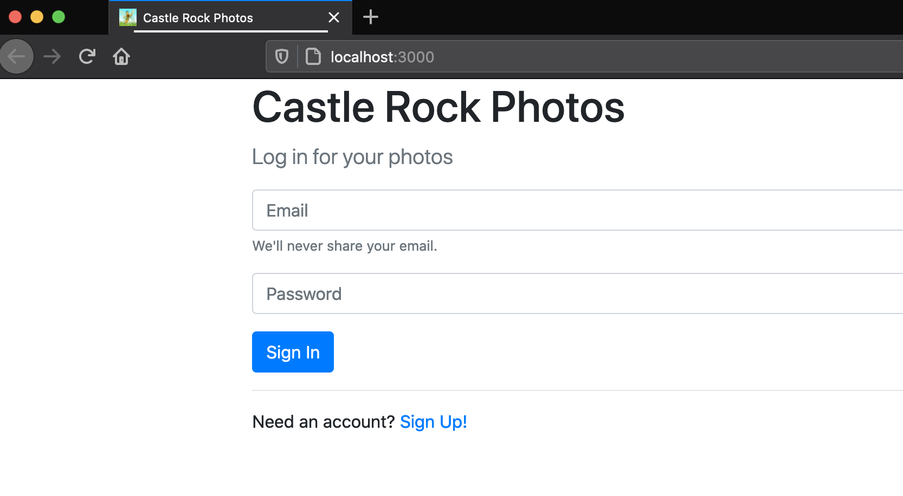

# React Application

There are a few ways you can run this next part.  You could create your react application from scratch using something like:

```
mkdir front-end
cd front-end
create-react-app . 
```

But instead we're going to just use the code we've already developed for this application and change parts we need to make it work with our AWS infrastructure. 

In this directory, you'll see there is a [front-end](./front-end) folder.  This is where the code is.  After downloading this and changing to this directory, we can run the following commands to start the application: 

```
yarn install 
yarn start
```

You'll notice that it is missing a file called `config.js`.  You can add this with: 

```
cd src/
cp config-example.js config.js
```
And the application will start. 



We need to let our user log in and log out.  To do that we'll have to create a micro service that handles user sign up, login , logout, etc.  This is a pretty big task.  Luckily, AWS has this micro service for us to use, and its called Cognito.  Let's create that now.  