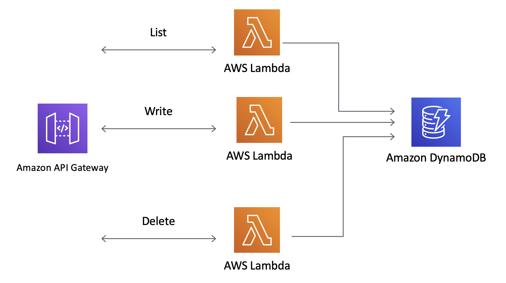
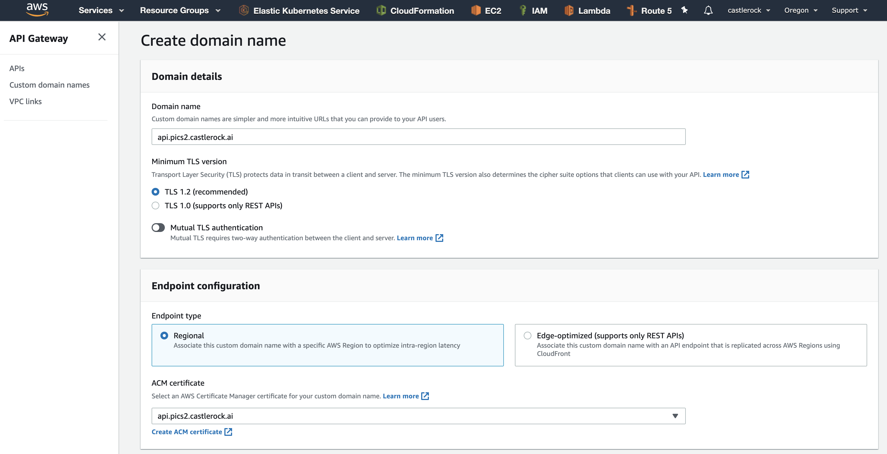
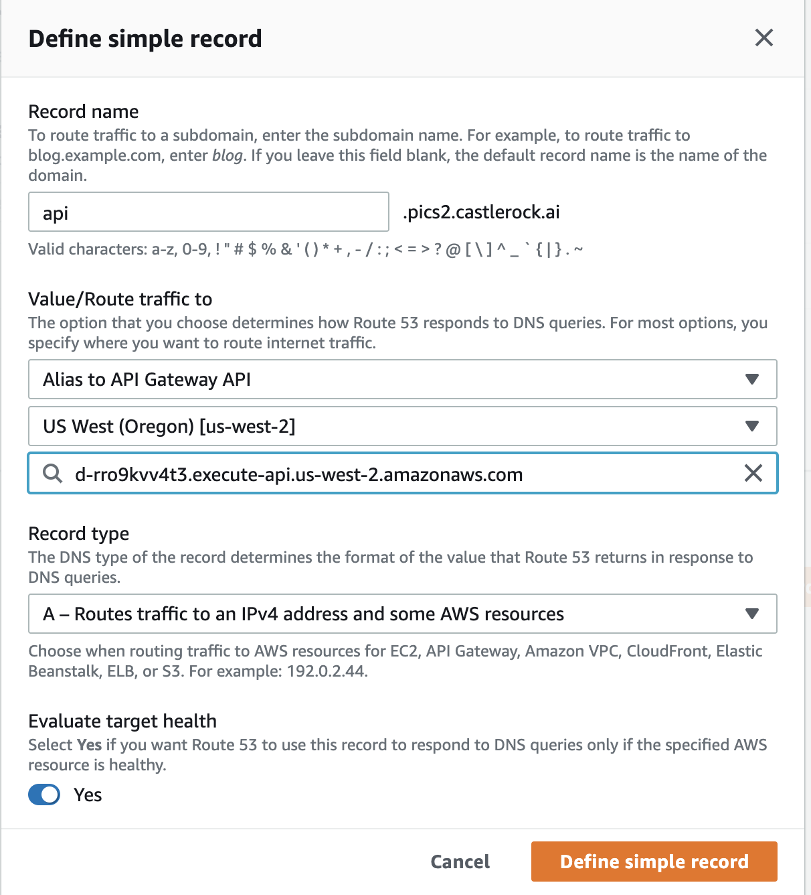

# Serverless Back End

There are many options for our backend API.  We could use any of the following: 

* [Elastic Beanstalk](https://aws.amazon.com/elasticbeanstalk/) - Legacy PaaS like systems. 
* [AWS EC2 Instances](https://aws.amazon.com/ec2/) - Just install nginx on it, patch servers and go.  
* [Amazon Elastic Kubernetes Service](https://aws.amazon.com/eks/) - Run containers as the backend. You could also use [Fargate](https://aws.amazon.com/fargate/) with EKS or use [ECS](https://aws.amazon.com/ecs/) instead!

This list is by no means exhaustive.  But the way we are going to do it is by using [Amazon API Gateway](https://aws.amazon.com/api-gateway/). 

Amazon API Gateway is a fully managed service that makes it easy for developers to create APIs. In this sense, you can look at it as a service for creating micro services. Or if you want to get more granular: A service for front ending functions. 

Our service is going to be pretty simple: 



Basically we have 3 functions: 

* List - This will contact DynamoDB and list all the photos that the user has uploaded. 
* Write - This will write metadata of a photo image that has been uploaded to S3. 
* Delete - This will delete images from S3 and from the Dynamo Database. 

These functions take less than 250 lines of code and we put them in the [photos.py](../serverless/photos.py) file.  This is written in Python, but you could just as well have written it in Go, Java or Javascript. 

## Serverless

To facilitate managing these functions in AWS, we are using the [serverless](https://serverless.com) framework which was introduced around 2015 at AWS Re:Invent. The idea was that it packages everything up in cloud formation and pushes changes to API Gateway, Lambda Functions, and even manages other resources like S3 buckets, Databases, and IAM roles. 

This is by no means the only way to do it.  [Zappa](https://github.com/Miserlou/Zappa) is another cool framework for Python on AWS Lambda + API Gateway. 

If you were to get started with a new serverless project you would run: 

```
mkdir serverless
cd serverless
serverless create --template aws-python
```

But we already have one started for you that we just need to modify. Navigate to the [`serverless.yml`](../serverless/serverless.yml) file and let's start editing. 

## 01 Prereqs

To set up our `serverless` functions we need to create a few more resources. 

### Photo Buckets

At this point we've created one bucket in S3 that is used for our website.  We are going to create 2 more buckets for where we can upload our photos.  One bucket is for our testing and the other for our real application. 

```
aws s3 mb s3://crpics2app
aws s3 mb s3://crpics2app-dev
```


### CORS for Photo Buckets. 

We'll have to add a policy for each bucket.  Go to the Bucket, then select `Permissions` and then select `CORS configuration`.  Add the following: 

```xml
<?xml version="1.0" encoding="UTF-8"?>
<CORSConfiguration xmlns="http://s3.amazonaws.com/doc/2006-03-01/">
<CORSRule>
    <AllowedOrigin>*</AllowedOrigin>
    <AllowedMethod>HEAD</AllowedMethod>
    <AllowedMethod>GET</AllowedMethod>
    <AllowedMethod>PUT</AllowedMethod>
    <AllowedMethod>POST</AllowedMethod>
    <AllowedMethod>DELETE</AllowedMethod>
    <MaxAgeSeconds>3000</MaxAgeSeconds>
    <ExposeHeader>x-amz-server-side-encryption</ExposeHeader>
    <ExposeHeader>x-amz-request-id</ExposeHeader>
    <ExposeHeader>x-amz-id-2</ExposeHeader>
    <ExposeHeader>ETag</ExposeHeader>
    <AllowedHeader>*</AllowedHeader>
</CORSRule>
</CORSConfiguration>
```
Do this for both buckets. 

## 02 Edit `serverless.yaml` file

### Service Name
The first part is the name of your service.  We have it set as `photos` but you can change it to whatever you want.  Like `pix` instead or something. 

### Provider Details

Serverless lets us run on multiple cloud platforms like GCP or Azure in addition to AWS. Here we provide AWS credentials.  You could get rid of the `profile` and it will just use your environment variables, or you could specify them here.  We'll leave this as it is. 


#### S3 Resources
You'll need to put the names of the buckets you created. The `"arn:aws:s3:::<your bucket>/*"` should work:

```yaml
  - "arn:aws:s3:::crpics2app/*"
  - "arn:aws:s3:::crpics2app-dev/*"
``` 

#### DynamoDB Resources
As you just created dynamoDB resources you should be able to get the ARN by navigating to dynamodb and checking each table.  They should look something like: 

```yaml
  - arn:aws:dynamodb:us-west-2:188966951897:table/photoUsers
  - arn:aws:dynamodb:us-west-2:188966951897:table/devPhotoUsers
```
 
### Custom Resources
There are several changes you can make to this section as well. 

#### `userPoolArn`
Change this to the userPool ARN of your serverless deployment.  You can get this by going to your Cognito User Pool and see it under General Settings. 

Should look something like: 

```
arn:aws:cognito-idp:us-west-2:188966951897:userpool/us-west-2_pDVw2CTHi
```

#### `dynamo_table`
Put the test and production buckets in.  This is just the name of the table without the arn stuff.  

```yaml
dynamo_table:
    prod: "photoUsers"
    dev: "devPhotoUsers"
```

#### `s3_bucket`
Put the test and production buckets in.  This is just the name of the buckets without the arn parts. These are the buckets you just created. 

```yaml
  s3_bucket:
    prod: "crpics2app"
    dev: "crpics2app-dev"
```
## 03 Deploy Serverless Functions

We will now deploy our serverless functions for `dev` and `prod` stages. 

```
npm install serverless-prune-plugin
sls deploy
sls deploy --stage=prod
```

You can now open up API Gateway and see the new API that was created. 

## 04 Create Custom Domain Names

We would like our API to have a meaningful name, so our apps can call it.  If you remember back in [Part 2](../PART02/CertManager.md) we created certificates for our APIs. Let's use those now. 

Open up [API Gateway](https://us-west-2.console.aws.amazon.com/apigateway/main/apis?region=us-west-2) and navigate to Custom Domain Names.  You'll have to remember the names you put on the certificate as you'll use that as the custom domain name. 



Notice that we are using regional here, but if you wanted to make the API globally fronted by cloud front then you could choose Edge Optimized as well. 

After creating the custom domain name we need to tie it to the actual API.  Select API Mappings and configure the mapping to the API.


You could map the API to something like /api/v1 to make paths interchangable, but we'll leave it blank for now. 

Once complete you should do this for the dev/stage API as well as the production API. 

## 05 Map Route53 DNS to the APIs

Now that we have our Custom Domain Name, let's go back to Route53 and point our DNS record to the service. 

We will create a simple record.  The records should auto populate as you select the types of records. 



This may take a few minutes to update.  When done, try sending API requests: 

```
curl https://api.pics2.castlerock.ai/photos
```

You'll probably get a response: 

```
{"message":"Missing Authentication Token"}
```
Because these APIs can only be accessed if the user is authenticated!

Don't forget to do this for both dev/prod APIs!