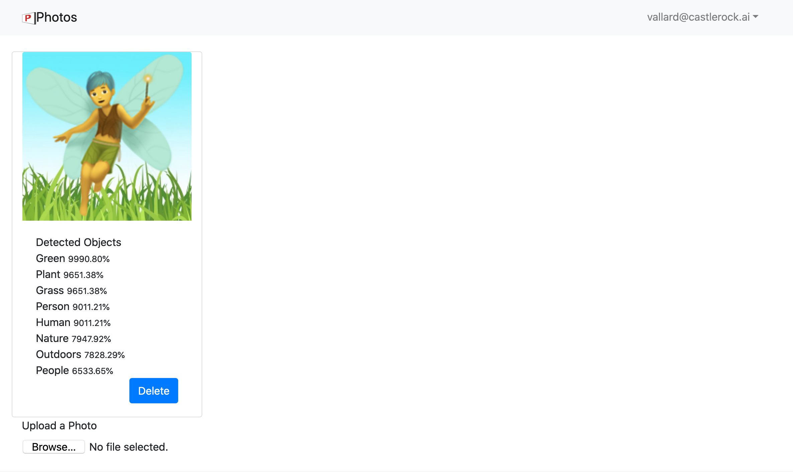

# Amazon Rekognition

With our images upload function working, we also got for free a function I snuck in the code.  And that is the ability to run photo detection on the images.  If you refresh the image, as long as it was a `png` or `jpg` file, then it will run Amazon Rekognition on the image. 

Refreshing the page, you'll see the objects that were detected: 



## 01 Manual Test

When you upload the image it is placed in `<yourbucket>/private/<user generated id>/<photoName>`. 

We can use Amazon Rekognition from the command line to get the objects: 

```
aws rekognition detect-labels --image "S3Object={Bucket=crpics2app-dev, Name=private/us-west-2:5d6ff6ce-ec8b-4738-a89b-bf549beaf607/lawnFairyIcon.png}"
```

Our ouput looks like: 

```
2.0
LABELS  99.90799713134766       Green
LABELS  96.51382446289062       Plant
LABELS  96.51382446289062       Grass
PARENTS Plant
LABELS  90.1120834350586        Human
LABELS  90.1120834350586        Person
INSTANCES       90.1120834350586
BOUNDINGBOX     0.8694280385971069      0.17651322484016418     0.09957584738731384     0.616865873336792
LABELS  79.47923278808594       Nature
LABELS  78.28292083740234       Outdoors
LABELS  65.33650970458984       People
PARENTS Person
```

The code in [`photos.py`](../serverless/photos.py) simply looks for this upload event, sends this command over, then writes the metadata back into DynamoDB so we have it ready for the user. 

This should all work now that we've put it all back together!